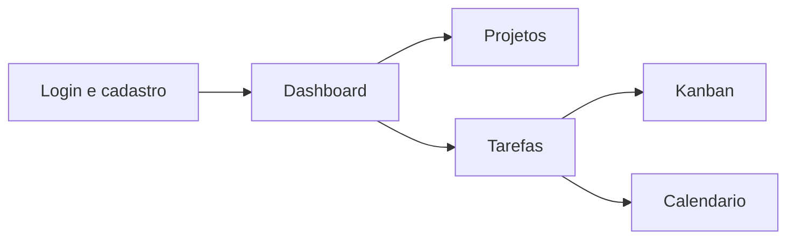

# Apresentacao - Sistema Gerenciador de Tarefas

Versao mais visual e com roteiro de fala natural.
Pensada para uma apresentacao de cerca de 5 minutos.

## Antes de montar os slides

Use estas imagens que ja existem no projeto:

- `public/screenshots/login-dark.png`
- `public/screenshots/dashboard-dark.png`

Se quiser deixar a apresentacao ainda mais visual, capture tambem as telas de:

- `Projetos`
- `Kanban`
- `Calendario`

Essas tres telas podem entrar como um trio no meio da apresentacao.

---

## Slide 1 - Capa

**No slide**

- Titulo: `Sistema Gerenciador de Tarefas Online`
- Subtitulo: `MVP funcional para gestao de projetos, tarefas, Kanban e calendario`
- Visual principal: use a imagem do dashboard como fundo ou como destaque lateral

**Fala sugerida**

Bom dia, pessoal. Nosso projeto e um sistema gerenciador de tarefas pensado para organizar demandas, prazos e responsaveis em um unico lugar. A ideia foi entregar algo simples, funcional e facil de demonstrar, dentro do que o PDF pediu.

---

## Slide 2 - Contexto e objetivo

**No slide**

- Problema: tarefas espalhadas em planilhas, mensagens e anotacoes
- Necessidade: mais controle sobre prioridades e prazos
- Visual de apoio: use a imagem do login para mostrar acesso controlado

**Fala sugerida**

O ponto de partida foi um problema bem comum: equipes que controlam atividades de forma solta, sem uma visao unica do que esta pendente, atrasado ou concluido. Entao, o objetivo do sistema foi justamente organizar esse fluxo e facilitar o acompanhamento das entregas.

---

## Slide 3 - O que o PDF pediu

**No slide**

- Cadastro e autenticacao de usuarios
- Criacao de projetos com prazos e membros
- Criacao, atribuicao, acompanhamento e conclusao de tarefas
- Visualizacao em quadro Kanban
- Integracao com calendario

**Visual extra**

**Fala sugerida**

Esses foram os requisitos que guiaram o desenvolvimento. Entao o projeto foi montado para cobrir exatamente esse fluxo: entrada do usuario, organizacao dos projetos, acompanhamento das tarefas, visao por etapas e controle dos prazos.

---

## Slide 4 - Demonstracao da interface

**No slide**

- Tela 1: login
- Tela 2: dashboard
- Destaque para o visual moderno e a navegacao simples

**Fala sugerida**

Aqui vale mostrar rapidamente como o sistema se comporta na pratica. Primeiro, o usuario acessa a tela de login. Depois, ao entrar, ele cai no dashboard, que traz uma visao executiva com indicadores, proximos prazos e atalhos para as principais funcoes.

---

## Slide 5 - Funcionalidades principais

**No slide**

- Projetos: criacao, edicao e membros
- Tarefas: titulo, descricao, prioridade, status e prazo
- Kanban: colunas `A fazer`, `Em andamento` e `Concluido`
- Calendario: tarefas por dia e proximos prazos

**Visual sugerido**

- Use capturas das telas de `Projetos`, `Kanban` e `Calendario` lado a lado
- Se nao tiver as capturas, mostre esses tres pontos em cards simples

**Fala sugerida**

O sistema foi organizado para cobrir o ciclo principal da gestao de tarefas. O usuario cria projetos, distribui tarefas, acompanha o andamento no Kanban e consulta os prazos no calendario. Isso deixa o fluxo mais claro e ajuda a demonstrar o valor da solucao.

---

## Slide 6 - Estrutura tecnica

**No slide**

- `Next.js 16`
- `React 19`
- `TypeScript`
- `Tailwind CSS 4`
- `shadcn/ui`
- `localStorage`

**Fala sugerida**

Na parte tecnica, a aplicacao foi feita como um frontend funcional, com estado centralizado em um provider e persistencia local no navegador. O projeto tambem passou por validacao com `npm run lint` e `npm run build`, o que garante que a base esta estavel para demonstracao.

---

## Slide 7 - Limites e melhorias

**No slide**

- Nao ha backend real nesta versao
- Nao ha banco de dados externo
- Os dados ficam salvos apenas no navegador
- O Kanban ainda nao tem drag and drop

**Melhorias futuras**

- Autenticacao real
- Banco de dados
- Arrastar e soltar no Kanban
- Relatorios e notificacoes

**Fala sugerida**

Como se trata de um MVP academico, a versao atual tem limites normais de frontend. Mesmo assim, ela entrega o fluxo principal pedido no trabalho. Como proximos passos, o sistema pode evoluir com backend, banco de dados e uma experiencia ainda mais completa.

---

## Slide 8 - Fechamento

**No slide**

- O sistema atende ao enunciado do projeto integrador
- A interface e simples e objetiva
- O fluxo principal ja esta funcionando

**Fala sugerida**

Para fechar, o projeto cumpre o que foi solicitado no PDF e mostra, de forma simples, um sistema funcional para organizacao de tarefas. A ideia foi entregar algo claro, util e facil de apresentar. Obrigado.

---

## Dica pratica para deixar mais visual

- Use a screenshot do login no momento de falar sobre acesso e autenticacao.
- Use a screenshot do dashboard para apresentar os indicadores.
- Se conseguir, capture as telas de `Projetos`, `Kanban` e `Calendario` no navegador e coloque no Slide 5.
- Tente manter cada slide com pouco texto e mais apoio visual.

