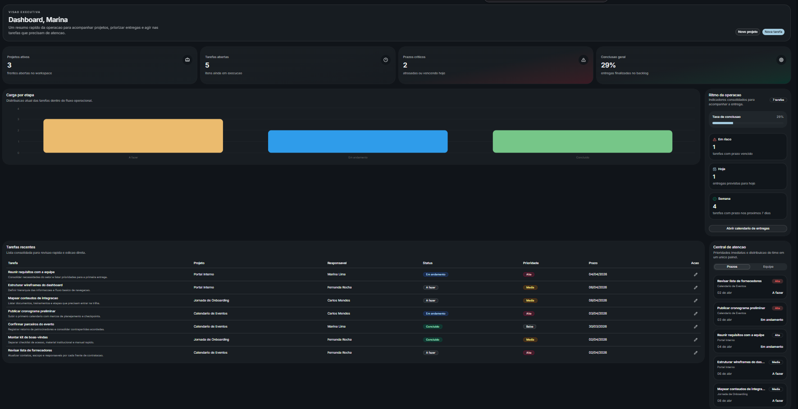
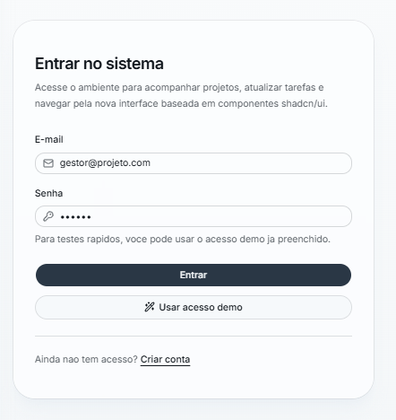
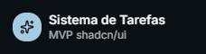

<div align="center">
  <h1>Sistema Gerenciador de Tarefas</h1>
  <p>
    MVP academico para gerenciamento de projetos e tarefas, com autenticacao local,
    dashboard executivo, quadro Kanban, calendario de entregas e interface moderna
    baseada em shadcn/ui.
  </p>

  <p>
    
    
    
    
  </p>

  <p>
    
    
    
    
  </p>
</div>

## Preview

<p align="center">
  
</p>

<table>
  <tr>
    <td width="60%">
      
    </td>
    <td width="40%">
      
    </td>
  </tr>
</table>

## Sobre o Projeto

Este projeto foi desenvolvido como atividade avaliativa com foco em demonstrar um fluxo completo de organizacao de demandas. A aplicacao simula um ambiente de trabalho simples, no qual usuarios conseguem entrar no sistema, cadastrar projetos, criar tarefas, acompanhar o andamento das entregas e visualizar os prazos em diferentes formatos.

Mesmo sendo um MVP, o projeto ja entrega uma experiencia coerente de produto:

- autenticacao local funcional
- navegacao protegida por sessao
- dashboard com visao executiva
- gerenciamento de projetos e tarefas
- kanban com atualizacao de status
- calendario para controle de prazos
- suporte a tema claro, escuro e sistema

## Principais Funcionalidades

### Autenticacao e sessao

- login com usuario de demonstracao
- cadastro local de novos usuarios
- persistencia de sessao entre recargas
- redirecionamento automatico entre rotas publicas e privadas

### Dashboard executivo

- cards com indicadores principais da operacao
- grafico com distribuicao das tarefas por etapa
- lista responsiva de tarefas recentes
- painel lateral com ritmo da operacao
- central de atencao com foco em prazos e equipe

### Gestao de projetos

- criacao de projetos com nome, descricao e prazo
- associacao de membros por projeto
- calculo de progresso com base nas tarefas vinculadas
- edicao por modal

### Gestao de tarefas

- criacao e edicao por modal
- vinculacao com projeto e responsavel
- controle de prioridade, prazo e status
- sincronizacao automatica com dashboard, kanban e calendario

### Kanban e calendario

- quadro com colunas `A fazer`, `Em andamento` e `Concluido`
- alteracao simples de status entre etapas
- filtro por projeto no Kanban
- visualizacao mensal de entregas no calendario
- listagem de tarefas por dia selecionado

### Interface

- componentes baseados em `shadcn/ui`
- sidebar responsiva
- modo `light`, `dark` e `system`
- tipografia com `Inter`
- padrao visual corporativo e limpo

## Stack Tecnologica

| Tecnologia | Uso no projeto |
| --- | --- |
| `Next.js 16` | Estrutura principal da aplicacao e roteamento com App Router |
| `React 19` | Construcao dos componentes e interatividade |
| `TypeScript` | Tipagem da aplicacao e seguranca no desenvolvimento |
| `Tailwind CSS 4` | Estilizacao utilitaria e tokens visuais |
| `shadcn/ui` | Biblioteca de componentes de interface |
| `Radix UI` | Base acessivel dos componentes usados pelo `shadcn/ui` |
| `next-themes` | Controle de tema claro e escuro |
| `date-fns` | Formatacao e manipulacao de datas |
| `Recharts` | Grafico do dashboard |
| `Sonner` | Toasts e mensagens de feedback |
| `Lucide React` | Iconografia do sistema |

## Arquitetura da Aplicacao

O projeto foi estruturado para separar rotas, componentes de interface, provider global e utilitarios.

### Rotas

- `app/(auth)`
  - `login`
  - `cadastro`
- `app/(app)`
  - `dashboard`
  - `projetos`
  - `kanban`
  - `calendario`

### Componentes principais

- `components/app`
  - shells, dialogs, cards, breadcrumbs, sidebar e componentes de dominio
- `components/ui`
  - componentes base do `shadcn/ui`
- `components/providers`
  - provider global da aplicacao

### Estado global

O estado principal fica em:

- `components/providers/app-provider.tsx`

Esse provider concentra:

- autenticacao local
- controle da sessao
- persistencia no navegador
- seed inicial de dados
- criacao e atualizacao de projetos
- criacao e atualizacao de tarefas

### Tipos centrais

Os principais contratos do sistema estao em:

- `lib/types.ts`

Modelos utilizados:

- `User`
- `Session`
- `Project`
- `Task`
- `TaskStatus`
- `TaskPriority`

## Persistencia e Dados

Toda a persistencia da versao atual acontece via `localStorage`, usando a chave:

```text
sgto:mvp-state
```

Dentro dessa estrutura ficam armazenados:

- usuarios
- sessao ativa
- projetos
- tarefas

Na primeira execucao, o sistema gera dados iniciais automaticamente para facilitar testes e demonstracoes.

## Credenciais de Demonstracao

Use as credenciais abaixo para entrar rapidamente no sistema:

- E-mail: `gestor@projeto.com`
- Senha: `123456`

Tambem e possivel criar um novo usuario pela tela de cadastro.

## Como Executar Localmente

### 1. Instale as dependencias

```bash
npm install
```

### 2. Rode o ambiente de desenvolvimento

```bash
npm run dev
```

### 3. Acesse no navegador

```bash
http://localhost:3000
```

## Scripts Disponiveis

```bash
npm run dev
```

Inicia a aplicacao em ambiente de desenvolvimento.

```bash
npm run build
```

Gera a build de producao.

```bash
npm run start
```

Executa a build de producao localmente.

```bash
npm run lint
```

Valida o codigo com ESLint.

## Estrutura de Pastas

```text
app/
  (auth)/
  (app)/
components/
  app/
  providers/
  ui/
hooks/
lib/
public/
```

### Resumo das pastas

- `app`
  - rotas da aplicacao
- `components/app`
  - componentes de negocio e layout do sistema
- `components/ui`
  - componentes base reutilizaveis
- `hooks`
  - hooks utilitarios
- `lib`
  - tipos, seed inicial, metadados e helpers
- `public`
  - assets estaticos e screenshots do README

## Validacao do Projeto

O projeto foi validado com:

```bash
npm run lint
npm run build
```

Ambos os comandos passam com sucesso.

## Limitacoes do MVP

Por se tratar de uma entrega funcional de frontend, esta versao possui limitacoes naturais:

- nao utiliza backend real
- nao utiliza banco de dados externo
- autenticacao apenas local
- dados salvos somente no navegador
- quadro Kanban sem drag and drop

Mesmo com essas limitacoes, o sistema atende o fluxo principal solicitado pela atividade e esta pronto para apresentacao academica.

## Evolucoes Futuras

Melhorias naturais para uma proxima versao:

- integracao com banco de dados
- autenticacao real com backend
- permissao por perfil de usuario
- notificacoes automatizadas
- anexos em tarefas
- drag and drop no Kanban
- relatorios e indicadores avancados

## Documentacao Complementar

Para uma explicacao mais detalhada do fluxo do sistema, consulte:

- [DOCUMENTACAO_APP.md](./DOCUMENTACAO_APP.md)

## Resumo Final

Este repositorio entrega uma base moderna, organizada e funcional para gerenciamento de tarefas, com foco em:

- clareza visual
- navegacao simples
- responsividade
- persistencia local
- demonstracao academica com cara de produto real
